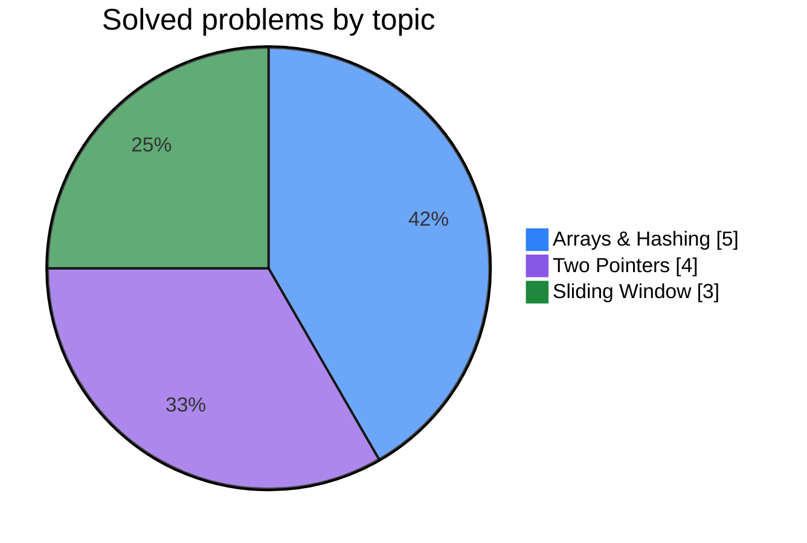
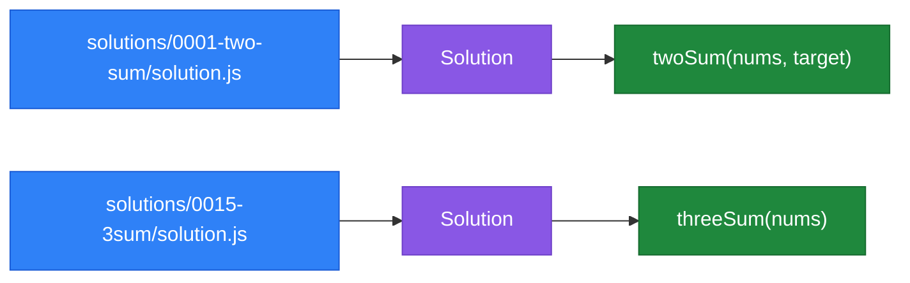

<div align="center">

# LeetCode Solutions

**One folder per problem — a clean write-up, a runnable solution, and an auto-updated knowledge graph.**

<br>


<a href="https://github.com/sombreror/algorithms-and-data-structure"></a>

<br>


<br>
<br>

[Progress](#progress) · [Solutions](#solutions) · [Repository layout](#repository-layout) · [Running a solution](#running-a-solution) · [Adding a new solution](#adding-a-new-solution) · [Knowledge graph](#knowledge-graph)

</div>

---

## Progress

| Difficulty | Solved | Share of solved | |
|:-----------|:------:|:---------------:|:--|
| ![Easy][easy] | **5** | 42% | ${\color{teal}\blacksquare\blacksquare\blacksquare\blacksquare}\color{lightgray}\square\square\square\square\square\square$ |
| ![Medium][medium] | **7** | 58% | ${\color{orange}\blacksquare\blacksquare\blacksquare\blacksquare\blacksquare\blacksquare}\color{lightgray}\square\square\square\square$ |
| ![Hard][hard] | **0** | 0% | $\color{lightgray}\square\square\square\square\square\square\square\square\square\square$ |

### By topic



---

## Solutions

All solutions are written in **JavaScript**. Click a problem for its write-up, or jump straight to the code.

> [!TIP]
> The theory behind each pattern (hand-drawn Excalidraw notes + templates) lives in the twin repo
> **[sombreror/algorithms-and-data-structure](https://github.com/sombreror/algorithms-and-data-structure)** — e.g. [Two Pointers](https://github.com/sombreror/algorithms-and-data-structure/tree/main/Algorithms/Two%20Pointers) and [Sliding Window](https://github.com/sombreror/algorithms-and-data-structure/tree/main/Algorithms/Sliding%20Window).

| # | Problem | Difficulty | Topic | Approach | Time | Space | Code |
|:-:|---------|:----------:|:-----:|----------|:----:|:-----:|:----:|
| 1 | [Two Sum](solutions/0001-two-sum/) | ![Easy][easy] | ![Arrays & Hashing][arrays] | One-pass hash map | `O(n)` | `O(n)` | [`solution.js`](solutions/0001-two-sum/solution.js) |
| 3 | [Longest Substring Without Repeating Characters](solutions/0003-longest-substring-without-repeating-characters/) | ![Medium][medium] | ![Sliding Window][window] | Sliding window + last-seen map | `O(n)` | `O(k)` | [`solution.js`](solutions/0003-longest-substring-without-repeating-characters/solution.js) |
| 11 | [Container With Most Water](solutions/0011-container-with-most-water/) | ![Medium][medium] | ![Two Pointers][pointers] | Two pointers | `O(n)` | `O(1)` | [`solution.js`](solutions/0011-container-with-most-water/solution.js) |
| 15 | [3Sum](solutions/0015-3sum/) | ![Medium][medium] | ![Two Pointers][pointers] | Sort + two pointers | `O(n²)` | `O(1)` | [`solution.js`](solutions/0015-3sum/solution.js) |
| 49 | [Group Anagrams](solutions/0049-group-anagrams/) | ![Medium][medium] | ![Arrays & Hashing][arrays] | Character-count key | `O(n·k)` | `O(n·k)` | [`solution.js`](solutions/0049-group-anagrams/solution.js) |
| 121 | [Best Time to Buy and Sell Stock](solutions/0121-best-time-to-buy-and-sell-stock/) | ![Easy][easy] | ![Sliding Window][window] | One pass, rolling minimum | `O(n)` | `O(1)` | [`solution.js`](solutions/0121-best-time-to-buy-and-sell-stock/solution.js) |
| 125 | [Valid Palindrome](solutions/0125-valid-palindrome/) | ![Easy][easy] | ![Two Pointers][pointers] | Filter & compare with reverse | `O(n)` | `O(n)` | [`solution.js`](solutions/0125-valid-palindrome/solution.js) |
| 167 | [Two Sum II — Input Array Is Sorted](solutions/0167-two-sum-II/) | ![Medium][medium] | ![Two Pointers][pointers] | Two pointers | `O(n)` | `O(1)` | [`solution.js`](solutions/0167-two-sum-II/solution.js) |
| 217 | [Contains Duplicate](solutions/0217-contains-duplicate/) | ![Easy][easy] | ![Arrays & Hashing][arrays] | Hash set | `O(n)` | `O(n)` | [`solution.js`](solutions/0217-contains-duplicate/solution.js) |
| 242 | [Valid Anagram](solutions/0242-valid-anagram/) | ![Easy][easy] | ![Arrays & Hashing][arrays] | Sort & compare | `O(n log n)` | `O(n)` | [`solution.js`](solutions/0242-valid-anagram/solution.js) |
| 347 | [Top K Frequent Elements](solutions/0347-top-k-frequent-elements/) | ![Medium][medium] | ![Arrays & Hashing][arrays] | Count & sort by frequency | `O(n log n)` | `O(n)` | [`solution.js`](solutions/0347-top-k-frequent-elements/solution.js) |
| 424 | [Longest Repeating Character Replacement](solutions/0424-longest-repeating-character-replacement/) | ![Medium][medium] | ![Sliding Window][window] | Sliding window + max frequency | `O(n)` | `O(1)` | [`solution.js`](solutions/0424-longest-repeating-character-replacement/solution.js) |

---

## Repository layout

```
leetcode/
├── README.md                        # this index
├── solutions/
│   ├── 0001-two-sum/
│   │   ├── README.md                # problem statement + approach + complexity
│   │   └── solution.js              # the solution (exports `Solution`)
│   ├── 0003-longest-substring-without-repeating-characters/
│   ├── 0011-container-with-most-water/
│   ├── 0015-3sum/
│   ├── 0049-group-anagrams/
│   ├── 0121-best-time-to-buy-and-sell-stock/
│   ├── 0125-valid-palindrome/
│   ├── 0167-two-sum-II/
│   ├── 0217-contains-duplicate/
│   ├── 0242-valid-anagram/
│   ├── 0347-top-k-frequent-elements/
│   └── 0424-longest-repeating-character-replacement/
└── graphify-out/                    # auto-generated knowledge graph (see below)
```

> [!NOTE]
> **Naming convention:** each folder is `<zero-padded-leetcode-id>-<kebab-slug>`, e.g.
> `0121-best-time-to-buy-and-sell-stock`. This keeps problems sorted by number and easy to find.

---

## Running a solution

Every `solution.js` exports the `Solution` class, so it runs under Node.js with no setup:

```bash
node -e '
  const Solution = require("./solutions/0001-two-sum/solution.js");
  console.log(new Solution().twoSum([2, 7, 11, 15], 9)); // [0, 1]
'
```

> [!TIP]
> Each problem's `README.md` includes a copy-paste example for its own method signature.

---

## Adding a new solution

1. Create `solutions/<id>-<slug>/` (pad the id to 4 digits).
2. Add `solution.js` exporting a `Solution` class, plus a `README.md` (copy an existing one as a template).
3. Add a row to the [Solutions](#solutions) table and bump the [Progress](#progress) counts.
4. Commit — the knowledge graph rebuilds itself (see below).

> [!IMPORTANT]
> Keep the Solutions table, the Progress counts, and the header badges in sync —
> they are updated by hand, not generated.

---

## Knowledge graph

This repo keeps a **knowledge graph** of the code under `graphify-out/`, generated with
[graphify](https://github.com/safishamsi/graphify). It maps every `file → Solution → method`,
so the structure of the repo can be read at a glance instead of opening every file:



| Artifact | What it is |
|----------|------------|
| [`graphify-out/graph.html`](graphify-out/graph.html) | Interactive graph — open in a browser |
| [`graphify-out/GRAPH_REPORT.md`](graphify-out/GRAPH_REPORT.md) | Human-readable report (key nodes, communities) |
| [`graphify-out/graph.json`](graphify-out/graph.json) | Raw graph data for querying |

The graph **rebuilds automatically after every commit** via a git post-commit hook.
To refresh it manually:

```bash
graphify update .        # incremental, AST-only, no API cost
```

---

<div align="center">

*One problem at a time.*

</div>

<!-- Badge definitions -->

[easy]: https://img.shields.io/badge/Easy-00b8a3?style=flat-square
[medium]: https://img.shields.io/badge/Medium-ffb800?style=flat-square
[hard]: https://img.shields.io/badge/Hard-ff375f?style=flat-square
[arrays]: https://img.shields.io/badge/Arrays_%26_Hashing-2f81f7?style=flat-square
[pointers]: https://img.shields.io/badge/Two_Pointers-8957e5?style=flat-square
[window]: https://img.shields.io/badge/Sliding_Window-1f883d?style=flat-square
